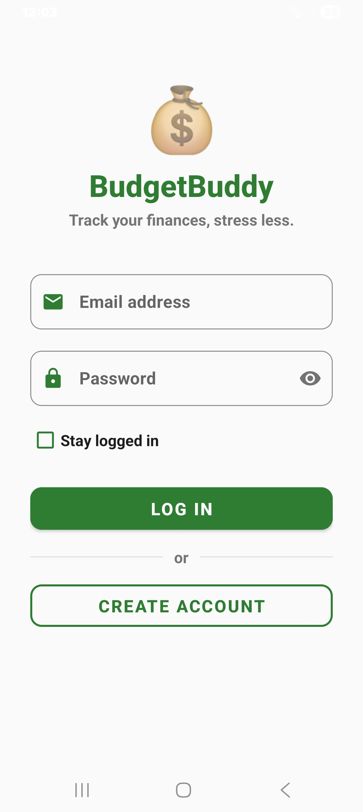
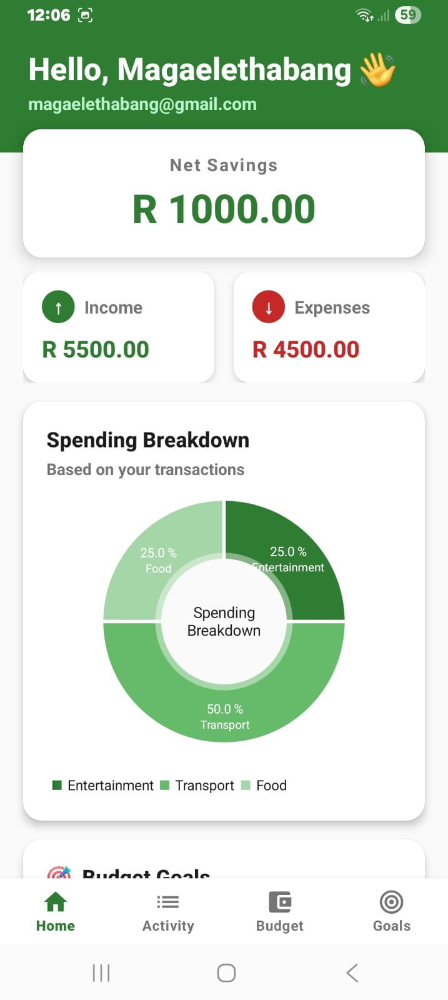
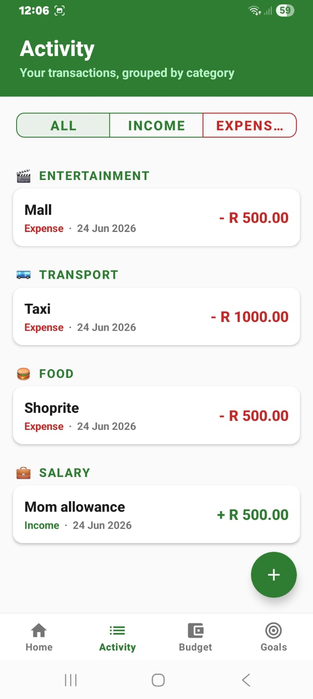
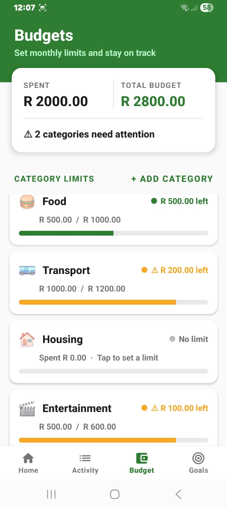
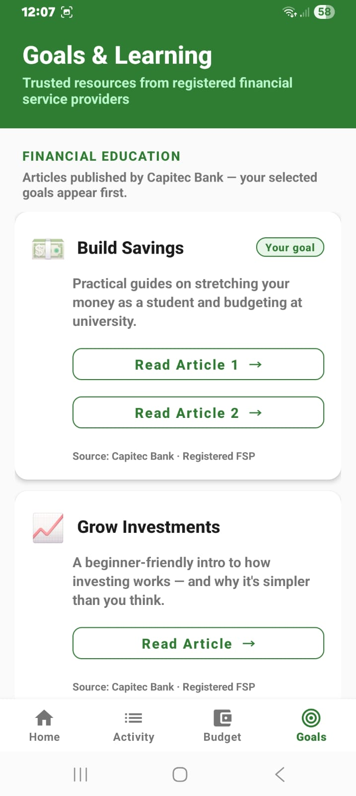

<div align="center">

# 💰 BudgetBuddy

### *Your money, your way.*

**A simple, on-device Android budget tracker built for South African students.**

[](https://www.android.com)
[](https://www.oracle.com/java/)
[](https://developer.android.com/about/versions/nougat)
[](https://developer.android.com/about/versions/15)
[](#license)

</div>

<div align="center">


**[⬇️ Download the latest APK](https://github.com/Thabang-Magaele/BudgetBuddy-android-app/releases/download/v1.1/BudgetBuddy-v1.1.apk)**

</div>

---

## ✨ What it does

BudgetBuddy is a lightweight personal-finance app aimed at students juggling NSFAS payouts, allowances, and part-time income. It does five things really well:

| 💵 **Track** | 📊 **Visualise** | 🎯 **Budget** | 📚 **Learn** | 🔒 **Stay private** |
|:---:|:---:|:---:|:---:|:---:|
| Add income & expenses with a category and date | See your spending breakdown in a clean pie chart | Set per-category monthly limits with alerts | Read curated articles from registered FSPs | Everything stays on your device — no servers, no analytics |

---

## 🚀 Features

### 🔐 Accounts & onboarding
- Email + password registration (multiple accounts supported)
- **Stay logged in** option for trusted devices
- 3-step onboarding: monthly income → monthly expenses → budget goals

### 📊 Home dashboard
- Net balance card (Income − Expenses) with overspend warning
- Tappable Income / Expenses cards that drill into filtered transaction lists
- Spending breakdown **pie chart** (powered by MPAndroidChart) — only appears once you have real data
- Personalised greeting and selected budget goals

### 📝 Activity tab
- Add a transaction with description, ZAR amount, category, and date
- All transactions grouped by category with emoji headers
- Filter by **All / Income / Expense**
- Tap any row → edit or delete

### 💳 Budget tab
- Set monthly limits per category (e.g. *Transport / R500*)
- Progress bars show spent vs. limit with traffic-light status:
  - 🟢 Under 80% — on track
  - 🟡 80–100% — near limit
  - 🔴 Over 100% — over budget
- Add your own **custom categories** (newest at the top)

### 🎯 Goals tab
- Financial education hub linking to **Capitec Bank** articles (a registered FSP)
- Cards are sorted so your selected onboarding goals appear first
- Topics: Build Savings · Grow Investments · Emergency Fund · Pay Off Debt · Retirement Planning

---

## 📸 Screenshots

<div align="center">
<table>
<tr>
  <td align="center" width="20%">
    <br/>
    <sub><b>Sign in</b></sub>
  </td>
  <td align="center" width="20%">
    <br/>
    <sub><b>Dashboard</b></sub>
  </td>
  <td align="center" width="20%">
    <br/>
    <sub><b>Add transaction</b></sub>
  </td>
  <td align="center" width="20%">
    <br/>
    <sub><b>Budget limits</b></sub>
  </td>
  <td align="center" width="20%">
    <br/>
    <sub><b>Financial education</b></sub>
  </td>
</tr>
</table>
</div>

---

## 🏗️ Architecture

BudgetBuddy follows a clean 3-layer structure within a single module:

```
┌─────────────────────────────────────────────────────────┐
│  PRESENTATION  ·  res/layout/*.xml                      │
│                                                         │
│  • activity_*.xml    Entry screens (Login, Register…)   │
│  • fragment_*.xml    Tab content (Home, Activity…)      │
│  • bottom_sheet_*    Modal forms (Add Transaction…)     │
│  • item_*.xml        RecyclerView row templates         │
└─────────────────────────────────────────────────────────┘
                          ▲
                          │
┌─────────────────────────────────────────────────────────┐
│  LOGIC  ·  com.budgetbuddy.budgetbuddy/*                │
│                                                         │
│  Activities                                             │
│  ├── LoginActivity, RegisterActivity                    │
│  ├── OnboardingActivity (3-step form)                   │
│  └── MainActivity      (bottom-nav host)                │
│                                                         │
│  Fragments                                              │
│  ├── HomeFragment      (dashboard + pie chart)          │
│  ├── ActivityFragment  (transaction list)               │
│  ├── BudgetFragment    (category limits)                │
│  └── GoalsFragment     (education hub)                  │
│                                                         │
│  RecyclerView Adapters                                  │
│  ├── TransactionAdapter (grouped by category)           │
│  └── BudgetAdapter      (progress + alerts)             │
└─────────────────────────────────────────────────────────┘
                          ▲
                          │
┌─────────────────────────────────────────────────────────┐
│  DATA  ·  com.budgetbuddy.budgetbuddy.model/*           │
│                                                         │
│  Models                                                 │
│  └── Transaction.java   (POJO + JSON serialisation)     │
│                                                         │
│  Stores (SharedPreferences-backed)                      │
│  ├── SessionStore       Stay-logged-in flag             │
│  ├── TransactionStore   All income & expense entries    │
│  ├── BudgetStore        Per-category limits             │
│  └── CategoryStore      User-added custom categories    │
└─────────────────────────────────────────────────────────┘
```

### 💾 Where data lives

Six SharedPreferences files, all private to the app and isolated per account:

| File | What it stores | Key format |
|---|---|---|
| `BudgetBuddyUsers` | Registered accounts | `email → password` |
| `BudgetBuddySession` | Stay-logged-in flag | `stay_logged_in_email → email` |
| `BudgetBuddyOnboarding` | Income, expenses, goals | `<email>_income`, `<email>_expenses`, `<email>_goals` |
| `BudgetBuddyTransactions` | Transactions as JSON array | `<email>_transactions` |
| `BudgetBuddyBudgets` | Per-category limits | `<email>_limit_<category>` |
| `BudgetBuddyCategories` | Custom categories | `<email>_custom` (JSON array) |

> **Note:** Passwords are stored as plain text — fine for a student project, but the next sprint should hash them with SHA-256 before saving.

---

## 🛠️ Tech stack

| Layer | Choice |
|---|---|
| **Language** | Java 8 |
| **IDE** | Android Studio |
| **Min SDK** | 24 (Android 7.0 Nougat) |
| **Target SDK** | 35 (Android 15) |
| **Build** | Gradle (Kotlin DSL) |
| **UI components** | Material Components, CardView, ConstraintLayout |
| **Charts** | [MPAndroidChart](https://github.com/PhilJay/MPAndroidChart) `v3.1.0` |
| **Persistence** | SharedPreferences (local-only, no network) |

---

## 🏃 Getting started

### Prerequisites
- Android Studio Hedgehog (2023.1.1) or newer
- JDK 17+
- An Android device or emulator running API 24+

### Clone and run

```bash
git clone https://github.com/<your-username>/BudgetBuddy.git
cd BudgetBuddy
```

Open the project in Android Studio, wait for Gradle sync, then hit **Run** ▶︎ — the app installs and launches on your device.

### Project setup details

```kotlin
android {
    namespace   = "com.budgetbuddy.budgetbuddy"
    compileSdk  = 35
    minSdk      = 24
    targetSdk   = 35
}
```

The project pulls MPAndroidChart from JitPack — your `settings.gradle.kts` needs:

```kotlin
dependencyResolutionManagement {
    repositories {
        google()
        mavenCentral()
        maven { url = uri("https://jitpack.io") }
    }
}
```

---

## 📂 Project structure

```
BudgetBuddy/
├── app/
│   ├── build.gradle.kts
│   └── src/main/
│       ├── AndroidManifest.xml
│       ├── java/com/budgetbuddy/budgetbuddy/
│       │   ├── LoginActivity.java
│       │   ├── RegisterActivity.java
│       │   ├── OnboardingActivity.java
│       │   ├── MainActivity.java
│       │   ├── HomeFragment.java
│       │   ├── ActivityFragment.java
│       │   ├── BudgetFragment.java
│       │   ├── GoalsFragment.java
│       │   ├── AddTransactionBottomSheet.java
│       │   ├── SetBudgetBottomSheet.java
│       │   ├── adapter/
│       │   │   ├── TransactionAdapter.java
│       │   │   └── BudgetAdapter.java
│       │   └── model/
│       │       ├── Transaction.java
│       │       ├── TransactionStore.java
│       │       ├── BudgetStore.java
│       │       ├── CategoryStore.java
│       │       └── SessionStore.java
│       └── res/
│           ├── layout/         (18 XMLs)
│           ├── drawable/       (icons, dots, pills, backgrounds)
│           ├── menu/           (bottom_nav_menu.xml)
│           ├── color/          (bottom_nav_selector.xml)
│           └── values/         (colors, strings, themes)
└── settings.gradle.kts
```

---

## 🗺️ Roadmap

### ✅ Shipped (v1.1)
- [x] Multi-account login & registration
- [x] Stay-logged-in option
- [x] 3-step onboarding (income, expenses, goals)
- [x] Dashboard with net balance + spending pie chart
- [x] Add / edit / delete transactions
- [x] Filterable transaction list (All · Income · Expense)
- [x] Per-category budget limits with traffic-light alerts
- [x] Custom budget categories
- [x] Financial education hub (linking to Capitec FSP articles)
- [x] Bottom navigation (Home · Activity · Budget · Goals)

### 🚧 Future improvements
- [ ] Hash passwords with SHA-256 before storing
- [ ] Forgot password via email OTP
- [ ] Monthly history view + CSV / PDF export
- [ ] Migrate persistence from SharedPreferences to Room
- [ ] Dark mode
- [ ] Optional cloud sync via Firebase
- [ ] In-app "Open a Capitec Account" deep link with referral attribution

---

## 🎓 About this project

BudgetBuddy was built as part of an **Android Programming Development** module (APD) — taken from idea to a production v1.1 APK that real students could install and use.

### Built with
- **Java** as the primary language (chosen for the module's curriculum)
- **Android Studio** with Kotlin DSL Gradle scripts
- A consistent **Forest Green** brand palette matching the BudgetBuddy logo (a friendly blue wallet character)

### Resource credits
- Capitec Bank educational articles linked in the Goals tab — used as third-party content from a registered FSP, with attribution on each card
- [MPAndroidChart](https://github.com/PhilJay/MPAndroidChart) by Philipp Jahoda for the pie chart
- [Material Components for Android](https://github.com/material-components/material-components-android) for UI primitives

---

## 📄 License

This project is licensed under the **MIT License** — see [`LICENSE`](./LICENSE) for details. *(If you don't have one yet, [choosealicense.com/licenses/mit](https://choosealicense.com/licenses/mit/) has the standard template.)*

---

## 🤝 Contributing

This is a student project, but if you're a fellow developer or learner who wants to extend it — pull requests welcome. Please:

1. Fork the repo and create a feature branch (`feature/your-feature-name`)
2. Keep commits small and descriptive
3. Match the existing code style (4-space indent, brace-on-same-line)
4. Open a PR with a screenshot if your change is visual

---

<div align="center">

**Made with ☕ and a tight student budget in Mbombela, Mpumalanga, South Africa.**

</div>
